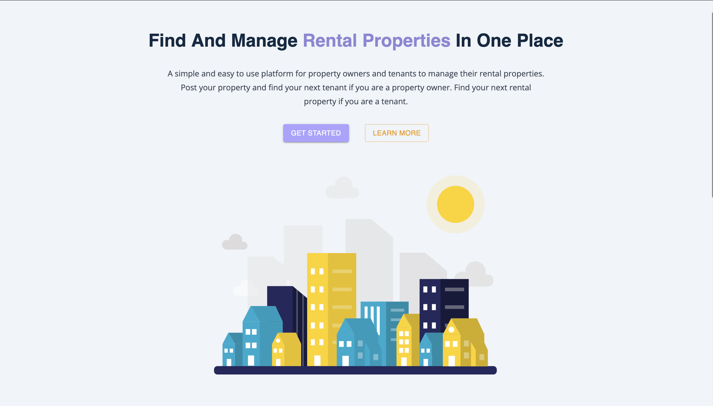
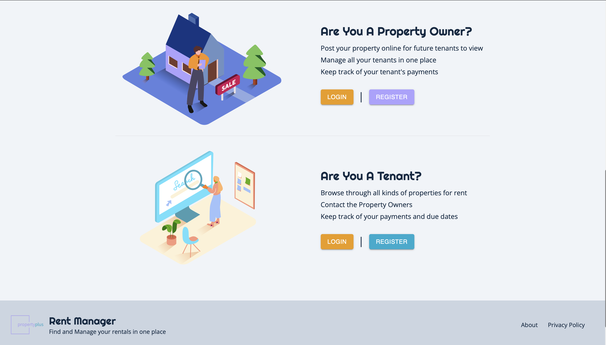
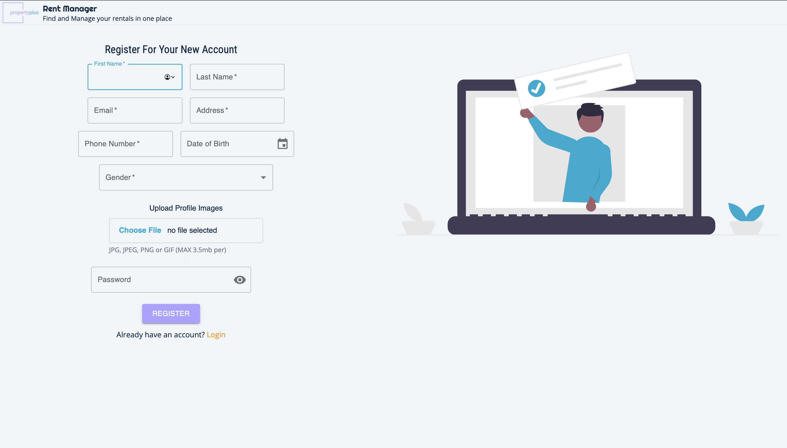
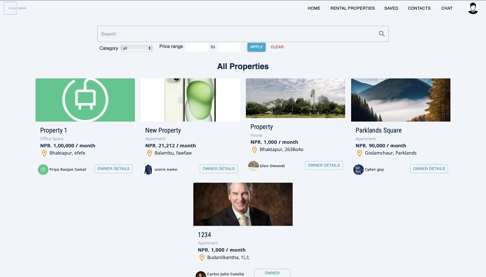
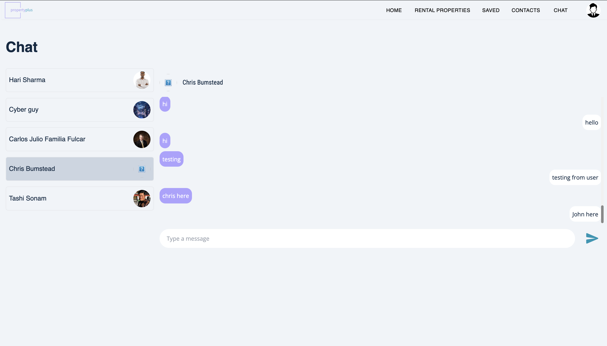
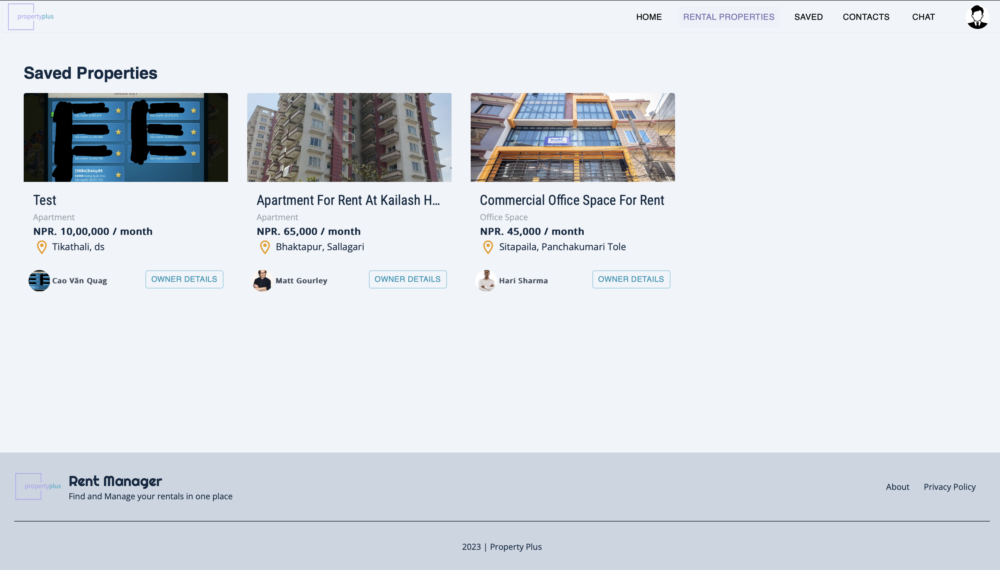

# property-plus
Here’s the updated README file including Redux:

Property Plus - Real Estate Rental and Tenant Management System

Live URL: [Property Plus](https://property-plus.onrender.com/#/)

Overview

Property Plus is a web-based real estate rental and tenant management system designed to streamline interactions between property owners and tenants. The platform caters to two types of users:

	•	Owner: Can post rental properties, manage tenants, register rent payments, and create property contracts.
	•	Tenant: Can search and filter available properties, view property details, communicate with owners, and utilize a built-in chat feature.

Features

	1.	Post Property for Rent: Owners can easily list properties with details like price, location, and amenities.
	2.	Search and Filter Properties: Tenants can perform detailed searches and apply filters to find the perfect home.
	3.	View Property Details: Each property has a dedicated page showcasing key information.
	4.	Built-in Chat Application: Enables seamless communication between owners and tenants within the app.
	5.	Secure JWT Authentication: Uses access and refresh tokens for user authentication, ensuring data security.
	6.	Email Communication: Tenants can directly email owners from the platform.
	7.	Create Property Contract: Owners can generate and manage rental agreements.
	8.	Manage Tenants: Owners can track and manage tenant information effortlessly.
	9.	Register Rent Payments: Allows owners to log rent payments made by tenants.
	10.	State Management: Efficiently managed using Redux for consistent and scalable state handling.

Technologies Used

	•	Frontend: React.js, CSS, HTML
	•	State Management: Redux
	•	Backend: Node.js, Express.js
	•	Database: MongoDB
	•	Authentication: JWT (JSON Web Token)
	•	Deployment: Render.com

## Screenshots

1. **Landing Page**  
   

2. **Login & Signup**  
   

3. **Login Page**  
   

4. **Registration Page**  
   

5. **Renter Page**  
   

6. **Tenant Page**  
   

7. **Chat**  
   

8. **Saved Properties**  
   
   
Installation and Setup

	1.	Clone the repository:

git clone https://github.com/yourusername/property-plus.git
cd property-plus

	2.	Install dependencies:

npm install

	3.	Configure environment variables:
	•	Create a .env file and add the necessary configuration details.
	4.	Start the development server:

npm start

Usage

	•	Owners: Register or log in to post and manage properties, tenants, and rent payments.
	•	Tenants: Register or log in to search for properties, view details, and communicate with owners.

Contributing

Contributions are welcome! Please fork the repository, make your changes, and create a pull request.

License

This project is licensed under the MIT License.

Make sure to replace path/to/your/image.jpg with the paths to your actual images. If you have any other additions or changes, feel free to let me know!
